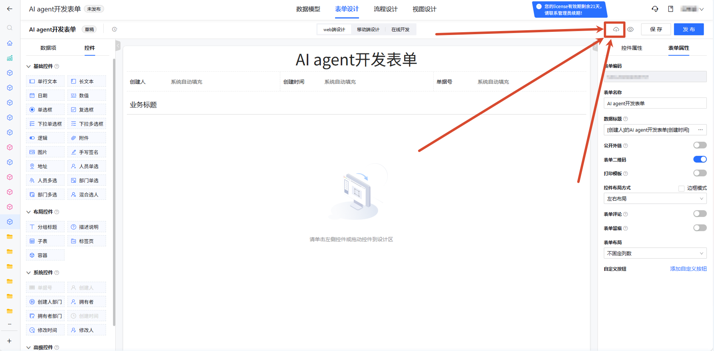

# 云枢表单脚手架

用于云枢低代码表单自定义开发的 TypeScript 类型辅助工具，支持 VSCode 智能提示和 AI Agent 自动编程。

## 功能特性

- ✅ **VSCode 智能提示** - 控件属性、方法自动补全
- ✅ **AI Agent 编程支持** - OpenCode、Trae 等 AI 工具自动生成代码
- ✅ **类型安全** - TypeScript 类型检查，减少运行时错误
- ✅ **代码模式参考** - 内置常用代码模式，快速上手

---

## 环境准备

### 1. 安装 Node.js

**Windows 系统**：

1. 访问 [Node.js 官网](https://nodejs.org/)
2. 下载 LTS 版本（推荐 v18 或更高版本）
3. 运行安装程序，一路下一步
4. 打开命令行验证安装：

```bash
node -v    # 应显示 v18.x.x 或更高
npm -v     # 应显示 9.x.x 或更高
```

**macOS 系统**：

```bash
# 使用 Homebrew 安装
brew install node

# 或下载安装包
# https://nodejs.org/
```

**Linux 系统**：

```bash
# Ubuntu/Debian
curl -fsSL https://deb.nodesource.com/setup_18.x | sudo -E bash -
sudo apt-get install -y nodejs

# CentOS/RHEL
curl -fsSL https://rpm.nodesource.com/setup_18.x | sudo bash -
sudo yum install -y nodejs
```

### 2. 安装编辑器

- **VSCode**（推荐）：[下载地址](https://code.visualstudio.com/)
- 或其他支持 TypeScript 的编辑器

---

## 快速开始

### 第一步：获取脚手架

```bash
# 克隆或下载项目
git clone <项目地址>
cd cloudpivot-js-help

# 安装依赖
npm install
```

### 第二步：导入云枢模板

1. 在云枢平台设计表单
2. 导出 HTML 模板，保存为 `template.html`（覆盖项目根目录的模板文件）

   

### 第三步：生成类型定义

```bash
npm run extract
```

这将生成：

- `src/custom.html` - HTML 片段
- `src/custom.css` - CSS 样式
- `src/custom.ts` - TypeScript 代码（含类型提示）
- `src/custom-types.d.ts` - 类型定义

---

## 使用场景

### 场景一：VSCode 智能提示

#### 开启类型检查

```bash
npm run dev
```

VSCode 会自动识别类型定义，实现：

**控件自动补全**：

```typescript
// 输入 this. 后自动提示所有可用控件
this.ShortText1775207152511.  // 自动提示 value, display, required 等
```

**方法提示**：

```typescript
// 子表方法自动补全
this.sheetField.appendRow(  // 自动提示参数类型
this.sheetField.getCell(    // 自动提示参数类型
```

**生命周期模板**：

在 `src/custom.ts` 中已预置生命周期模板，直接编写业务逻辑即可：

```typescript
form.on('onLoad', function(data, dataPermission) {
  // 输入 data. 自动提示所有控件 key
  // 输入 this. 自动提示所有控件和方法
});

form.on('onRendered', function(data) {
  // 控件访问示例
  this.textField.value = 'hello';
});
```

#### 类型检查效果

| 功能          | 效果                                    |
| ----------- | ------------------------------------- |
| 控件 key 自动补全 | ✅ 输入 `this.` 或 `data.` 后提示            |
| 控件属性提示      | ✅ 显示 `value`, `display`, `required` 等 |
| 方法参数提示      | ✅ 显示参数类型和说明                           |
| 类型错误提示      | ✅ 赋值类型错误会红色波浪线                        |

---

### 场景二：AI Agent 自动编程

#### 支持的 AI 工具

- **OpenCode** - 推荐
- **Trae** - 推荐
- **Cursor**
- **Claude Code**
- 其他支持项目文档的 AI 编程工具

#### 使用方法

**方式一：直接对话**（推荐）

让AI读取项目中的 `AGENTS.md` 文件，获取：

- 项目结构和约束
- 代码模式参考
- 控件使用方法
- 生命周期事件说明

**示例对话**：

```
用户：参考 AGENTS.md 文档，帮我在custom.ts实现一个功能，当金额超过 10000 时，自动显示审批人字段

AI：（自动读取 AGENTS.md，生成代码）
form.on('onRendered', function(data) {
    this.amount.valueChange.subscribe(function(change) {
        if (change.value > 10000) {
            this.approver.display = true;
            this.approver.required = true;
        } else {
            this.approver.display = false;
            this.approver.required = false;
        }
    });
});
```

#### AI Agent 的优势

| 传统方式        | AI Agent 方式 |
| ----------- | ----------- |
| 手动查阅 API 文档 | 自动理解项目约束    |
| 容易写错控件 key  | 自动补全正确的 key |
| 不熟悉生命周期     | 自动选择正确的事件   |
| 代码风格不一致     | 遵循项目已有模式    |

---

## 开发流程

### 完整工作流

```
┌─────────────────────────────────────────────────────────────┐
│  首次使用                                                    │
├─────────────────────────────────────────────────────────────┤
│  1. npm install                 # 安装依赖                   │
│  2. 覆盖 template.html          # 从云枢导出模板             │
│  3. npm run extract             # 生成 src/ 文件             │
│  4. 编辑 src/custom.ts          # 编写业务代码               │
│  5. npm run dev                 # 开启类型检查               │
│  6. 复制代码到云枢              # 部署到平台                  │
└─────────────────────────────────────────────────────────────┘

┌─────────────────────────────────────────────────────────────┐
│  模板更新后（会覆盖所有文件！）                                │
├─────────────────────────────────────────────────────────────┤
│  1. 覆盖 template.html          # 从云枢导出新模板           │
│  2. npm run extract             # 重新生成（覆盖 custom.ts）  │
└─────────────────────────────────────────────────────────────┘

┌─────────────────────────────────────────────────────────────┐
│  已有代码，只想更新类型                                       │
├─────────────────────────────────────────────────────────────┤
│  1. 编辑 src/custom.html        # 手动添加新控件             │
│  2. npm run refresh-types       # 更新类型，保留用户代码     │
└─────────────────────────────────────────────────────────────┘
```

### 脚本命令

| 命令                      | 用途                   | 覆盖文件         |
| ----------------------- | -------------------- | ------------ |
| `npm run extract`       | 从 template.html 完整生成 | 全部覆盖         |
| `npm run refresh-types` | 仅更新类型定义              | 仅类型文件，保留用户代码 |
| `npm run dev`           | 类型检查监听               | 不修改文件        |

---

## 文件说明

```
cloudpivot-js-help/
├── template.html           # 云枢导出的原始模板（只读）
├── src/
│   ├── custom.html         # HTML 片段 → 复制到云枢 HTML 窗口
│   ├── custom.css          # CSS 样式 → 复制到云枢 CSS 窗口
│   ├── custom.ts           # TypeScript 代码 → 编译后复制到 JS 窗口
│   └── custom-types.d.ts   # 类型定义（自动生成，勿编辑）
├── types/                  # 静态类型定义
│   ├── controls.d.ts       # 控件类型
│   ├── form-instance.d.ts  # 表单实例类型
│   └── lifecycle.d.ts      # 生命周期类型
├── 表单开发API/            # 官方 API 文档
├── scripts/
│   ├── extract.mjs         # 完整生成脚本
│   └── refresh-types.mjs   # 类型刷新脚本
└── AGENTS.md               # AI Agent 指引文档
```

---

## 添加新控件

### 方式一：完整更新

1. 在云枢平台设计表单，添加新控件
2. 导出模板覆盖 `template.html`
3. 运行 `npm run extract`

> ⚠️ 注意：会覆盖所有 src/ 文件，已有代码会丢失！

### 方式二：仅更新类型（推荐）

1. 手动编辑 `src/custom.html`，按格式添加控件
2. 运行 `npm run refresh-types`

**控件格式参考**：

```html
<!-- 短文本 -->
<a-text key="ShortTextXXXXXXXXXXXX" data-name="控件名称" data-span="24"></a-text>

<!-- 数值 -->
<a-number key="NumberXXXXXXXXXXXX" data-name="控件名称" data-span="24" data-format1="integer"></a-number>

<!-- 单选 -->
<a-radio key="RadioXXXXXXXXXXXX" data-name="控件名称" data-span="24" data-options="选项1;选项2"></a-radio>

<!-- 人员选择 -->
<a-user-selector key="StaffSingleXXXXXXXXXXXX" data-name="控件名称" data-span="24" data-dept-visible="user" data-default-value="[]" data-org-root="[]"></a-user-selector>

<!-- 子表 -->
<a-sheet key="SheetXXXXXXXXXXXX" data-name="子表" data-span="24">
    <a-columns>
        <a-text key="col1" width="150" data-name="列1"></a-text>
    </a-columns>
</a-sheet>
```

---

## 常见问题

### Q: 控件 key 从哪里获取？

A: 在云枢平台设计表单后，导出 HTML 模板，控件 key 在 HTML 标签的 `key` 属性中。运行 `npm run extract` 后，`custom.ts` 头部会列出所有可用控件。

### Q: 为什么 TypeScript 报错找不到类型？

A: 确保已运行 `npm run extract` 或 `npm run refresh-types` 生成类型定义。VSCode 可能需要重启才能识别新类型。

### Q: 如何保留已写的代码不被覆盖？

A: 使用 `npm run refresh-types` 命令，只更新类型定义，不覆盖用户代码。或者在运行 `npm run extract` 前备份 `custom.ts`。

### Q: 最终代码怎么部署到云枢？

A: 

1. `src/custom.html` → 复制到云枢 HTML 编辑窗口
2. `src/custom.css` → 复制到云枢 CSS 编辑窗口
3. `src/custom.ts` → 编译为 JS → 复制到云枢 JS 编辑窗口

### Q: 支持 IE 浏览器吗？

A: 云枢平台支持 IE。在 `onRendered` 中不要用箭头函数，使用 `function` 语法，通过 `window.h3form` 获取控件。

---

## 参考资源

- **API 文档**：`表单开发API/` 目录
- **代码模式**：`AGENTS.md` 文件
- **类型定义**：`types/` 目录

---

## 技术栈

- TypeScript 5.x
- Node.js 18+
- ESM 模块

---

## 许可证

MIT
